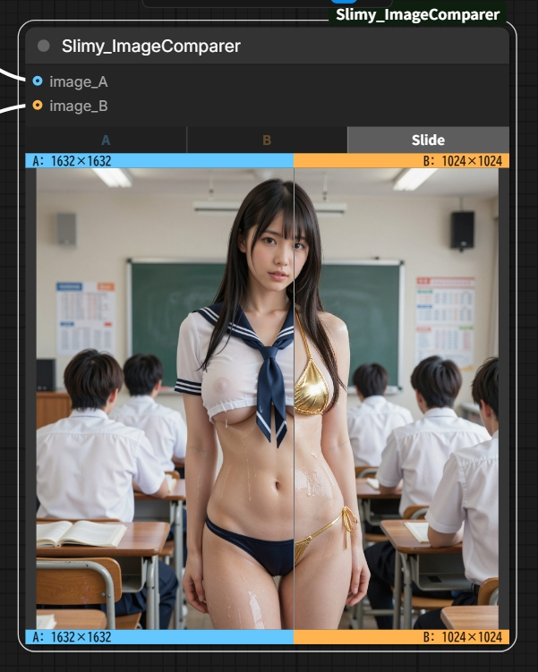

# Slimy_ImageComparer

A/B画像をインタラクティブに比較できる ComfyUI カスタムノードです。
rgthree氏のコードを参考に改良を加えたものです
(https://github.com/rgthree/rgthree-comfy)



## 機能

- [ A / B / Slide] の3モードで2枚の画像を比較
- 各画像の解像度をノード上に表示
- A/Bそれぞれ色分けされたラベル付き

## インストール

```bash
cd ComfyUI/custom_nodes
git clone https://github.com/Slimy-Comfy/Slimy_ImageComparer
```

その後 ComfyUI を再起動してください。

## 使い方

1. ノード追加メニューから `Slimy` カテゴリを開く
2. **Slimy_ImageComparer** を追加
3. `image_A` と `image_B` に比較したい画像を接続
4. ノード上部のボタンでモードを切り替え
5. 表示されている画像を保存したい場合は、画像を右クリックで「画像Aをコピー/画像Aを保存/画像Aを開く」といったメニューが利用できます

| モード | 動作 |
|--------|------|
| A      | 画像Aのみ表示 |
| B      | 画像Bのみ表示 |
| Slide  | スライダーでA/Bを分割比較 |

## 動作環境

- ComfyUI（最新版推奨）
- 追加の pip インストールは不要

## ライセンス

MIT
